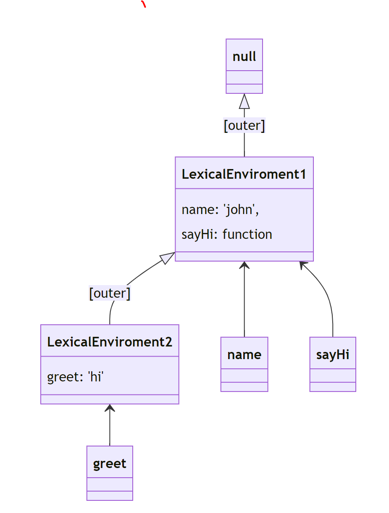
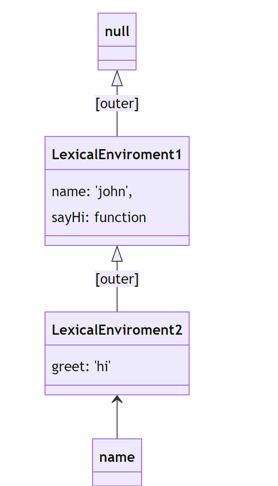

# Scope / Closure / Lexical Environment / Currying.

---

- We have 3 types of variable in JavaScript **var, let , const**

- var is the old one, and should not be used now in any case. As it has many issues with creating scopes
- Also there are 4 kinds of scope in Javascript - **Block Scope, Global Scope, Function Scope, Module Scope**

### Block scope & Global Scope:

- The scope is the current context of execution in which values and expressions are "visible"

### Global Scope:

- Any variable/expression which is written outside - i.e. not inside any functions, blocks etc.

- `This is shared across files`.

  - 2 ta .js file jodi ekta html file er maddhome linked thake , tahole oy 2 ta .js file will behave as a single file.

  - So, `let` diye only 1 ta variable declare kora jabe.1 tar beshi variable thakle error hobe.

  - `i.e.` 2 linked .js can not have this variable more than once: `let abc = 20;`
  - But there will be no error if variable declared in var in 2 linked file i.e. `var abc = 20`;

#### Let

- let
  this creates a `block scope`

- `re-declaration in NOT allowed` (in same scope)

- `re-assignment is allowed`

```JS
{ // block scope
  let x = 0;
  let y = 0;
  console.log(x); // 0
  let x = 1; // Error
}
{
  let x = 1;
  let y = 1;
  x = 2;
  console.log(x);// 2
}

console.log(x); // Error in Global Scope. Because x is not declared in global scope. It is declared in LOCAL SCOPE.
```

### Temporal Dead Zone(TDZ) :

- the area in which a variable is not accessible. Temporal because it depends on time of excution not position

```JS
{
    console.log(a);

    let a = 1;
    // Line 50,51,52 is called TDZ for variable a.
    // Because we cant use a in these lines.
}
{
  // TDZ starts
  const say = () => console.log(msg); // hi

  let msg = 'hi';
  say(); // No error. Because of time.
}
```

### const

- this creates a block scope
- `re-declaration` in NOT allowed
- `re-assignment` is NOT allowed
- **Must be assigned at declaration time**.

```JS
{
  const x; //Error
  const y=0;
}

{
  const x=1;
  x=2   // Error
}

console.log(x); // Error
```

### Variable Shadowing

```js
let x = 0; // shadowed variable
{
  let x = 1;
  console.log(x);
}
```

### var

- it doesn't have any block scope, and can be re-declared
- it only had function scope
- var are `hoisted`, so **_they can be used before the declaration_**

`Hoisted is a concept, jeta declaration ke shobar top e niye jay.`

```js
var x = 1;
var x = 2; // valid

console.log(y); // valid but undefined
var y = 3;

z = 4;
console.log(z); // valid
var z;
```

### Let vs Var

```js
// For every i there will be separate scope.
for (let i = 0; i < 5; i++) {
  setTimeout(() => console.log(i), 1000);
} // prints 0,1,2,3,4

//i will be declared as global scope.
//Before 1 sec loop will be run 5 times and value of i will be equal to 5.
for (var i = 0; i < 5; i++) {
  setTimeout(() => console.log(i), 1000);
} // prints 5,5,5,5,5
```

`NOTE :` You should NOT use var now ❌

### Module scope

- In modern javascript, a file can be considered as module, where we use **export** and **import** syntax to use variable across files.

```C++
// Because of type="module" these 2 linked files will behave as a module..
//Means No global scope presents among them.
<script src="index.js" type="module"></script>
<script src="test.js" type="module"></script>

//We can import and export variable like these between these files
export { someVar, someFunc};
import { someVar} from './index.js';

```

### global Object

- The global Object is the variable` window` in case of browser.
- This helps you to use variables across the scopes. Also, it is the `this` value for global functions

  - window.alert
  - window.Promise

- In non-browser environment, window doesn't exist. but other global objects exist.
- var affects this global obejct, also function declarations.

```js
function sayHi() {
  console.log(this); // this will refer to window
}
// Strict mode can change this behaviour;
`use strict`;

function sayHi() {
  console.log(window); // this is a better way of code
}
```

### Function Scope:

- it is created upon execution a function

```Js
function sayHi(name){
    return name;
}

sayHi() // this call will create a function scope

sayHi() // this call will create another function scope
```

### Lexical Environment

- Every variable in JavaScript (within global / block / or function) has a reference to an object-like data called Lexical enviroment.
- This object (kind of object) serves as the basis of search for value of variable.

```Js
let name = 'john'
console.log(name)
```

- Lexical Enviroment (Global variable)

  - 

```js
let name = "john";

function sayHi() {
  let greet = "hi";
  console.log(greet);
}

sayHi();
console.log(name, sayHi);
```

- Lexical Enviroment (functions)
  - 

```JS
let name = 'john';

function sayHi(){
  let greet = "hi"
  console.log(name)
}

sayHi()
```

- 

### Hoisting

- The movement of variable declaration to top of scope - before execution

- `function declarations` are properly hoisted (value accessible)

- `var` is hoisted.

```JS
let name = 'john';

sayHi() // valid

function sayHi(){
  let greet = "hi"
  console.log(name)
}

sayHello() // error
let sayHello = function(){
   console.log(name)
}

```
## Closures:

- For Closures concept we need to understand `nested function` basic.

```Js
function createUser(name){
  let greeting = 'Hi ' 
  function greet(){
     return greeting + name + ' is Created';
  }
  return greet()//Greet function ta call hyse. tay greet function er vitor ja ache tay return hyse.
}
createUser('john') // Hi john is created;

```
- In above example:
  - **_createUser_** is `outer function`, **_greet_** is `inner function`.Both created a nested function.

  - `Inner function (greet)` have access of `outer function's (createUser)` parameter `(name)` and variable `(greeting)`.
  - So, the output is -> "Hi john is created" 
- <span style="color:red"> Now more useful work is if we can return the greet function itself.</span>

```Js
function createUser(name){
  let greeting = 'Hi ' 
  function greet(){
     return greeting + name + ' is Created';
  }
  return greet // returned just definition of function
}

let welcomeJohn = createUser('john') 
// In welcomeJohn there exists a function definition
welcomeJohn() //we are calling the function
 // output->Hi john is created;

```

- **This is Closure**

  - `welcomeJohn` function definition has access

    - to outer `params ( name )` which came for `createUser function`
    - also any other` "variables"` declared `inside createUser` will also be accessible to this welcomeJohn

- <span style="color:red"> example of closure:</span>
```Js
function initCounter() {
  let count = 0;
  return function () {//returning inner funciton
    count++;
  };
}

let counter = initCounter();
counter() // 0
counter() // 1
// Jotobar counter() call hobe totobar count er value barte thakbe.
//cause counter() call korar maddhome inner function call kora hocche. 
//inner funtion e count er ager man stay kortese..
let counter1 = initCounter();
counter1() // 0
counter1() // 1
// jotobar counter1() call hobe totobar count barte thakbe..
```
- <span style="color:red">In the above example,  </span>
  - <span style="color:skyblue">eta bujha jay je `outer function` er `count` variable ta preserve thaktese. bayre theke kew access niye change korte parbe na.</span>

- ***NOTE :*** so whenever you have a function which wants to preserve a value over many calls - it's a time for closure.


- <span style="color:red"> Real Life example of closure:1</span>
```js
function initCounter(id) {
  let count = 0;
  return function () {
    count++;
    document.getElementById(id).innerText = count;
  };
}
let count = 10;
let counter1 = initCounter('btnCount1');
let counter2 = initCounter('btnCount2');

// here `btn1` and `btn2` are id of HTML buttons.
  
<button onclick="counter1()">1</button>
<p id="btnCount1"></p>
<button onclick="counter2()">2</button>
<p id="btnCount2"></p>
```
- <span style="color:red"> Real Life example of closure:2</span>

```Js
function initAddString(inputId, outputId) {
  let str = '';
  return function () {
    str += ' ' + document.getElementById(inputId).value;
    document.getElementById(inputId).value = '';
    document.getElementById(outputId).innerText = str;
  };
}

let strAdder1 = initAddString('text1', 'text-output1');
let strAdder2 = initAddString('text2', 'text-output2');
<input type="text" id="text1">
<button onclick="strAdder1()">Add String</button>
<p id="text-output1"></p>

<input type="text" id="text2">
<button onclick="strAdder2()">Add String</button>
<p id="text-output2"></p>
```

### IIFE - Immediately Invoked Function Expression

- this practice was popular due to var.
- Immediately invoking a function avoids - re-declaration of variables

```Js
// Immediately invoked function expressions
(function(){
      var x = 1;   // this var is now protected
})()


(function(a){
      var x = a;   // this var is now protected
})(2)
```
- `var` ke jodi global scope e declare kora hoy tahole shob jayga theke access kora jay.
- ekta scope er bayre `var` er access off korte ey system use kora hoy.

### Currying

- working with multiple nested function.

- <span style="color:red"> Basic structure of curried function</span>

  - Type 1:
    ```js
    function sum(a){
      return function(b){
        return function(c){
          console.log(a,b,c)
          return a+b+c
        }
      }
    }
    ```
  - Type:2

      ```Js
        let sum = a => b => c => a+b+c
      ```
  - ***Breakdown Whats happening there:***

    - sum is a function that takes an argument a and returns another function.

    - The returned function takes an argument b and returns yet another function.

    - The last returned function takes an argument c, and when it's called, it returns the sum of a, b, and c.

- <span style="color:red"> Way of calling a currying a function</span>
    - A curring function is:
    
      ```js
        let log = time => type => msg => `At ${time.toLocaleString()}: severity ${type} => ${msg}`
      ```
    - The `way of calling` the currying function is:
      ```Js
        log(new Date())('error')('power not sufficient')

        // Output:

        // At 7/28/2023, 3:31:49 a.m.: severity error => power not sufficient
      ```
    - `Another way of calling` the currying function is :
      ```Js
        let logNow = log(new Date())

        logNow('warning')('temp high')

        //or 

        let logErrorNow = log(new Date())('error')

        logErrorNow('unknown error')
      ```
- <span style="color:red"> Real Life example</span>
  
    ```js
      function op(operation) {
        return function (a) {
          return function (b) {
            operation === 'add' ? a + b : a - b;
        };
      };
      const add3 = op('add')(3);
      const sub3 = op('sub')(3);
      const add = op('add');

      add3(6);
      sub3(6);
      zdd(1)(2);
    }
    ```